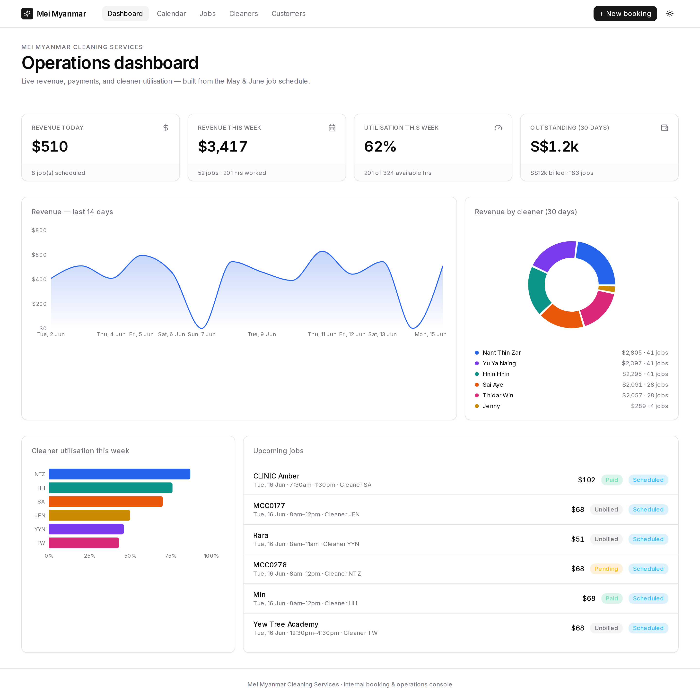
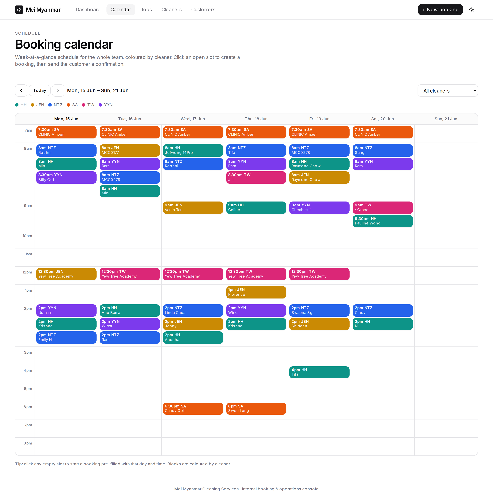
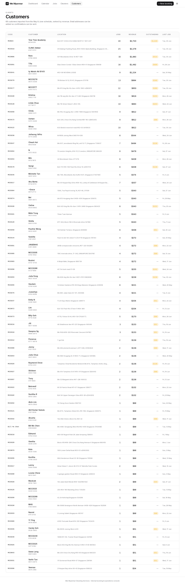

# Mei Myanmar Cleaning Services — Booking & Operations Console

An internal web app for a part-time cleaning agency. Service staff book jobs on a
calendar, set the hours and amount, assign a cleaner, and email the customer a
confirmation — while management sees live **revenue**, **outstanding payments**,
and **cleaner utilisation**.

> Seeded with the agency's **real May + June schedule** — 6 cleaners, ~68 customers,
> and 380 jobs — imported from the source spreadsheets into `data/jobs.seed.json`.

## What it does

- **Dashboard** (`/`) — revenue today / this week / last 30 days, team utilisation,
  outstanding (unpaid) amount, revenue-by-cleaner mix, and upcoming jobs.
- **Calendar** (`/calendar`) — week-at-a-glance schedule, colour-coded by cleaner,
  filterable. Click any empty slot to start a booking pre-filled with that day/time.
- **New booking flow** — pick (or create) a customer, set the date / start time /
  **hours** (amount auto-fills at the hourly rate and stays editable), assign a
  cleaner, set payment status, then **send the customer a confirmation email**.
  Double-bookings for the same cleaner are blocked.
- **Jobs** (`/bookings`) — searchable list; filter by job/payment status, mark jobs
  complete, mark payments received, see who has been emailed.
- **Cleaners** (`/cleaners`) — roster with weekly availability and each cleaner's
  utilisation, job count, and revenue for the week.
- **Customers** (`/customers`) — every client ranked by revenue, with outstanding
  balance and last job date.

## Pricing model

Jobs are priced **by the hour** (default **S$17/hour**, set in `lib/seed-data.ts`
as `COMPANY.hourlyRate`). The amount auto-fills as `hours × rate` and staff can
override it on any booking. The imported history is valued the same way.

## Tech

Next.js 14 (App Router) · TypeScript · Tailwind · Recharts · better-sqlite3.
Data lives in a local SQLite file (`data/cleaning.db`), auto-created and seeded
from `data/jobs.seed.json` on first run.

## Run locally

```bash
pnpm install      # builds the better-sqlite3 native binding
pnpm dev          # http://localhost:3000
```

Other scripts: `pnpm build` / `pnpm start` (production), `pnpm typecheck`.
To reset the data, delete `data/cleaning.db*` and restart — it reseeds.

## Customising for the client

- **Cleaners** — names, phone numbers, and weekly availability are in
  `SEED_CLEANERS` (`lib/seed-data.ts`).
- **Hourly rate / company details** — `COMPANY` in the same file.
- **Jobs & customers** — `data/jobs.seed.json`, regenerated from the monthly
  schedule spreadsheets. New jobs entered in the app are stored in SQLite.

## Email sending

The confirmation email is fully composed (subject + body, customer-addressed) and
previewed before sending. With no SMTP credentials wired up, **Send confirmation**
records the send and offers an "Open in mail app" (`mailto:`) fallback. Imported
customers have phone numbers but no email yet — add an email on the booking to send
a confirmation. To send automatically, plug an email provider (Resend / SendGrid /
SMTP) into `app/api/bookings/[id]/email/route.ts`.

## Screenshots

| Dashboard | Calendar |
| --- | --- |
|  |  |

| Jobs | Customers |
| --- | --- |
|  |  |
