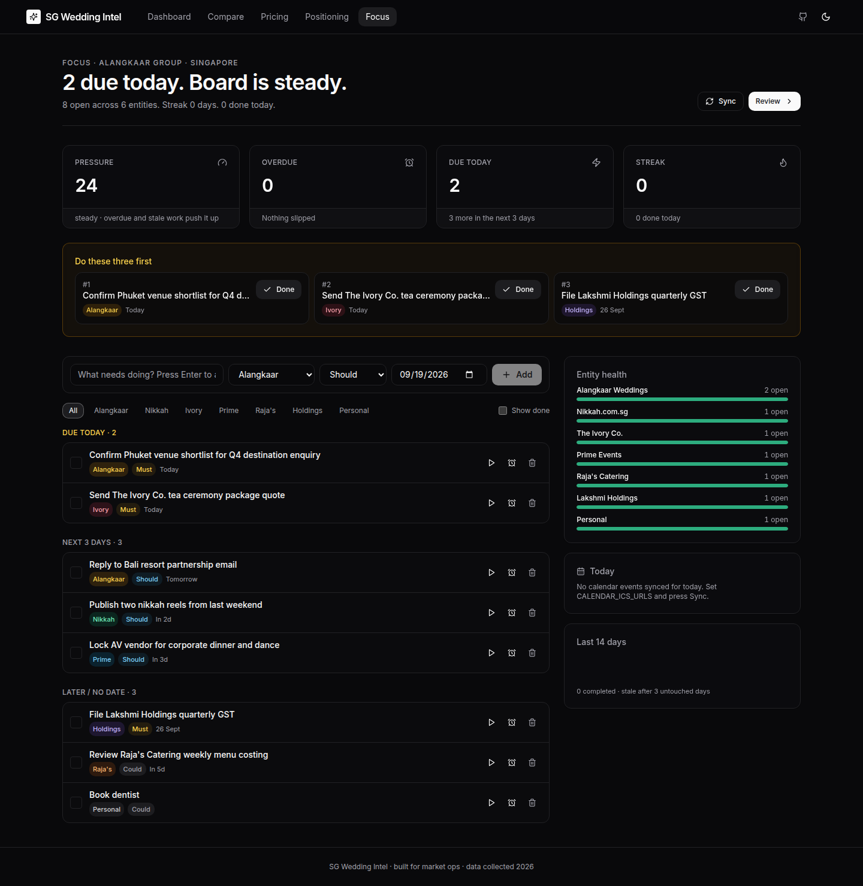
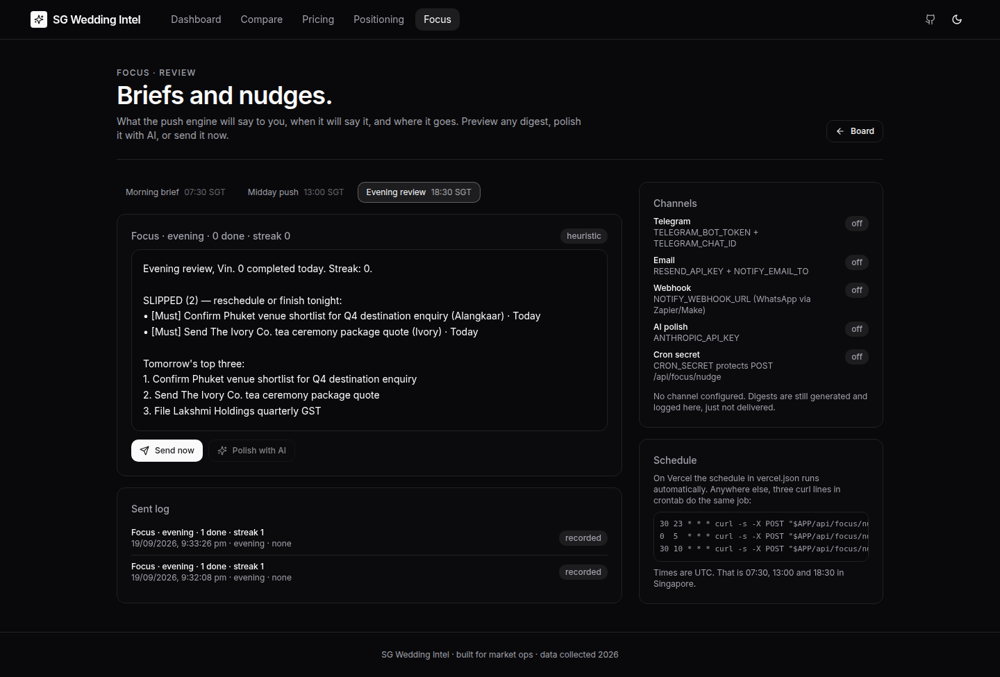
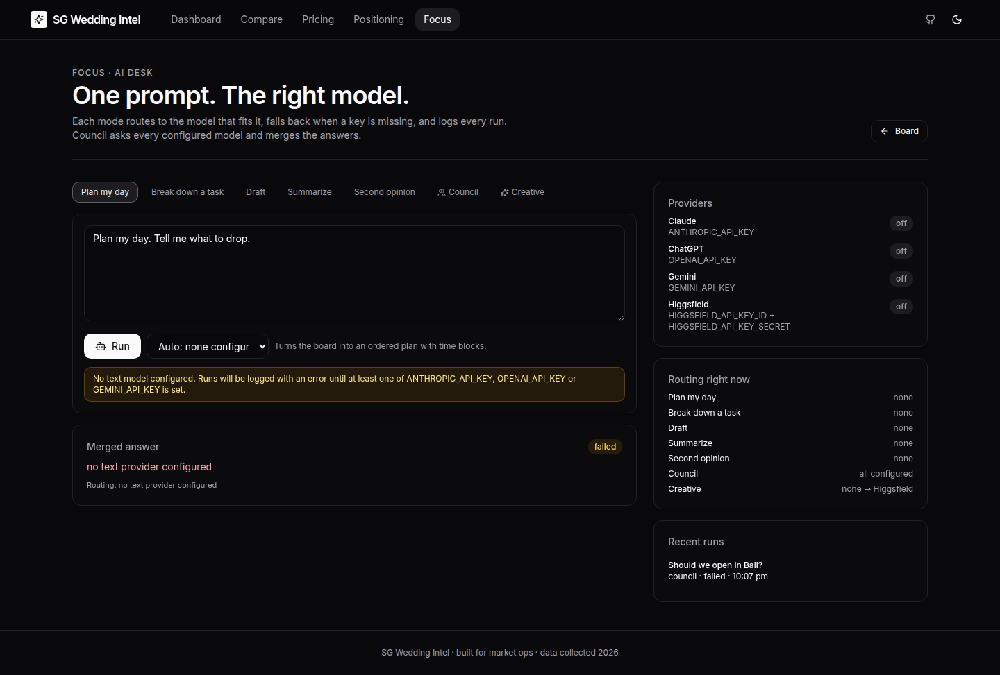

# SG Wedding Intel

> Singapore Luxury Indian Wedding Market — one dashboard. Six vendors, normalised.

Pricing, reach, breadth, and SWOT across six Singapore Indian wedding planners — Alangkaar, 8 Asthas, KM Wedding Services, Divine Bride, Rasa Weddings and 1-Stop Wedding. Next.js 14 · TypeScript · Tailwind · SQLite · react-pdf · Playwright.

---

## Screens

**Dashboard** — KPIs, vendor league table, services coverage.


**Competitor matrix** — sort any column, filter by required services, export to PDF.


**Pricing heatmap** — SGD per wedding (150-pax eq.) across four tiers.


**Positioning map** — spend × breadth × IG-reach bubble scatter with quadrant legend.


**Vendor detail + SWOT** — per-vendor dossier; SWOT generated by the Anthropic API when configured, otherwise by a transparent offline heuristic (labelled in the UI).


**Focus board** — one task list across every entity; pressure, overdue, streak; "do these three first".



**Focus review** — morning / midday / evening digests, send log, channel and cron status.



**AI desk** — one prompt routed to Claude, ChatGPT, Gemini or Higgsfield, or all of them in council.



---

## Run it

```bash
pnpm i && pnpm dev
```

That's it. The app boots at `http://localhost:3000` with data already seeded into SQLite from `data/vendors.seed.json` on first request.

### Optional — Anthropic-backed SWOTs

```bash
export ANTHROPIC_API_KEY=sk-ant-...
# optional:
export ANTHROPIC_MODEL=claude-sonnet-4-5
pnpm dev
```

Without the key, the SWOT API falls back to a deterministic, fact-referenced heuristic (the UI clearly labels the source; results are cached to `data/swot-cache/<slug>.json`).

### Focus — task tracking + push engine

`/focus` is a single board for every Alangkaar Group entity (Alangkaar Weddings, Nikkah.com.sg, The Ivory Co., Prime Events, Raja's Catering, Lakshmi Holdings, plus Personal). It works with zero configuration and grows with each env var you add.

**What it does**

- Tracks tasks with entity, priority (Must / Should / Could), due date and status. Quick-add from the board, or sync from ClickUp and any ICS calendar feed.
- Classifies the board every time it renders: overdue, due today, next 3 days, stale (untouched 3+ days), chronic snoozers (pushed back twice or more), done today.
- Pushes: a **pressure** score (0–100), a completion **streak**, per-entity **health**, and a "do these three first" strip that always ranks overdue work above everything else.
- Three digests a day — morning brief (07:30 SGT), midday push (13:00), evening review (18:30) — sent to Telegram, email, or a webhook (WhatsApp via Zapier/Make). Preview and send any of them from `/focus/review`.
- Optional AI polish: with `ANTHROPIC_API_KEY` set, Claude rewrites each digest to be sharper. Without it, the heuristic text is used and labelled as such.

**Configure** (all optional, see `.env.example`)

| Variable | Enables |
| --- | --- |
| `TELEGRAM_BOT_TOKEN` + `TELEGRAM_CHAT_ID` | Telegram delivery |
| `RESEND_API_KEY` + `NOTIFY_EMAIL_TO` | Email delivery via Resend |
| `NOTIFY_WEBHOOK_URL` | JSON POST to any webhook (WhatsApp bridges, n8n, Zapier) |
| `CRON_SECRET` | Locks the send endpoint. Vercel Cron passes it automatically. |
| `CLICKUP_API_TOKEN` (+ `CLICKUP_TEAM_ID`) | Pulls tasks assigned to you from ClickUp |
| `CALENDAR_ICS_URLS` | Today's agenda from Google Calendar's secret iCal address (comma-separated `Name=url`) |
| `ANTHROPIC_API_KEY` | AI-polished digests |

**Schedule.** `vercel.json` already defines the three crons. Anywhere else, three curl lines in crontab do the same job (times in UTC):

```
30 23 * * * curl -s -X POST "$APP/api/focus/nudge?kind=morning&sync=1&secret=$CRON_SECRET"
0  5  * * * curl -s -X POST "$APP/api/focus/nudge?kind=midday&secret=$CRON_SECRET"
30 10 * * * curl -s -X POST "$APP/api/focus/nudge?kind=evening&secret=$CRON_SECRET"
```

**API**

| Route | Method | Purpose |
| --- | --- | --- |
| `/api/focus/tasks` | GET, POST | List (`?done=1`, `?entity=`) and create |
| `/api/focus/tasks/:id` | GET, PATCH, DELETE | Update fields, `{status}`, `{touch:true}`, or `{action:"snooze",days}` |
| `/api/focus/report` | GET | Full classification + 14-day completion histogram |
| `/api/focus/nudge` | GET, POST | GET previews (`?kind=`, `&ai=1`); POST (or GET `&send=1`) sends and logs |
| `/api/focus/sync` | POST | Pull ClickUp + calendar |
| `/api/focus/seed` | POST | Starter tasks, only onto an empty board |

The tracker lives in its own SQLite file (`data/focus.db`, git-ignored, override with `FOCUS_DB_PATH`).

### AI desk — multi-model routing

`/focus/ai` sends one prompt to the model that fits the job, falls back when a key is missing, and logs every run against the task it was about.

| Mode | Routes to | Fallback chain |
| --- | --- | --- |
| Plan my day, Break down a task, Draft | Claude | ChatGPT → Gemini |
| Summarize | Gemini | Claude → ChatGPT |
| Second opinion | ChatGPT | Gemini → Claude |
| Council | every configured text model in parallel | merged by Claude, or the first configured model |
| Creative | Claude writes a visual brief | Higgsfield renders it (skipped if not configured) |

Every task row on the board has an "Ask AI" button that opens the desk with the task attached and Break down pre-selected. Plan mode injects the live board (overdue, due today, calendar) into the prompt automatically.

**Configure** (any subset)

| Variable | Default model | Enables |
| --- | --- | --- |
| `ANTHROPIC_API_KEY` (+ `ANTHROPIC_MODEL`) | `claude-opus-5` | Claude, with server-side refusal fallback on |
| `OPENAI_API_KEY` (+ `OPENAI_MODEL`) | `gpt-5.6` | ChatGPT |
| `GEMINI_API_KEY` (+ `GEMINI_MODEL`) | `gemini-3.8-flash` | Gemini |
| `HIGGSFIELD_API_KEY_ID` + `HIGGSFIELD_API_KEY_SECRET` (+ `HIGGSFIELD_MODEL_PATH`) | `higgsfield-ai/soul/v2/standard` | Higgsfield text-to-image for Creative mode |

With no key set, runs are still recorded with an honest "no text provider configured" error so the desk never fakes an answer. Higgsfield output links expire after seven days, so save what you want to keep.

**API**

| Route | Method | Purpose |
| --- | --- | --- |
| `/api/ai/run` | POST | `{mode, prompt, provider?, taskId?, context?}` → the recorded run |
| `/api/ai/runs` | GET | Recent runs (`?task=`, `?limit=`) |
| `/api/ai/providers` | GET | Which providers are configured and where each mode routes right now |

### Refresh research

```bash
pnpm refresh
```

For each vendor with a URL, the refresh agent:
1. Fetches the public site (10 s timeout, polite UA).
2. Reads `schema.org` JSON-LD to pick up `aggregateRating` → updates `googleRating`/`googleReviews` when present.
3. Stamps `updatedAt` on each record.
4. Reseeds the SQLite DB.

Instagram follower and Google review counts require `ig Graph API` / `Places API` tokens to scrape reliably — when absent, existing values are preserved and the TODO is printed (no fabrication).

---

## Architecture

```
app/               Next 14 App Router
 ├─ page.tsx         Dashboard
 ├─ compare/         Competitor matrix
 ├─ pricing/         Heatmap
 ├─ positioning/     2D scatter
 ├─ vendor/[slug]/   Dossier + SWOT
 ├─ focus/           Task board · focus/review/ digests + send log · focus/ai/ AI desk
 └─ api/
      ├─ vendors/         GET dataset
      ├─ swot/            GET per-vendor SWOT (Anthropic or heuristic)
      ├─ export-pdf/      GET streaming PDF (compare | vendor)
      ├─ focus/           tasks · report · nudge · sync · seed
      └─ ai/              run · runs · providers
components/        React UI (shadcn-style primitives + chart wrappers + focus/)
lib/               db · vendor-types · swot · pdf · utils
                   focus-types · focus-db · nudge (pure engine) · notify · focus-sync · focus-ai
 └─ ai/            types · providers (Claude, ChatGPT, Gemini, Higgsfield) · router · store
data/
 ├─ vendors.seed.json   Committed research — source of truth
 ├─ vendors.db          SQLite (git-ignored, re-seeded on boot)
 ├─ focus.db            Task tracker SQLite (git-ignored)
 ├─ swot-cache/         Cached SWOT JSON per vendor
 └─ screenshots/        README screenshots (captured by Playwright)
scripts/
 ├─ seed.ts          Reseed SQLite from JSON
 └─ refresh.ts       Refresh agent (pnpm refresh)
tests/e2e/          Playwright (3 flows + screenshots)
```

## Data model

```ts
type Vendor = {
  slug: string
  name: string
  tagline: string
  foundedYear: number | null
  url?: string
  instagramHandle?: string
  instagramFollowers: number
  googleRating: number                // 0–5
  googleReviews: number
  services: Service[]                 // 17 verticals available
  pricing: { tier, label, perPaxSgd?, packageSgd? }[]
  dataConfidence: "verified" | "partial" | "estimated"
  sources: { url, note }[]
  updatedAt: string                   // ISO
}
```

Every vendor row carries its own `dataConfidence` and an explicit `sources[]` list. The UI surfaces these on the detail page so you can audit the number, not just trust it.

## Tests

```bash
pnpm test:e2e
```

Three flows are covered end-to-end:

| Spec                  | Covers                                                         |
| --------------------- | -------------------------------------------------------------- |
| `dashboard.spec.ts`   | KPI cards render, vendor list loads, link navigates to detail. |
| `compare.spec.ts`     | Sort, name-filter, service-filter, and PDF export link.        |
| `charts.spec.ts`      | Heatmap table shape, positioning scatter renders 6 SVG points, `/api/export-pdf` returns a real PDF. |
| `focus.spec.ts`       | Add, start, snooze, complete; KPI headline and groups follow; digest preview and send-log on `/focus/review`; API validation. |
| `nudge-engine.spec.ts` | Pure engine: Singapore-time date helpers, classification, ranking, streaks, entity health, digest text, ICS parsing. |
| `ai-router.spec.ts`   | Routing table, fallback chain, forced provider; API validation; offline run recorded honestly; task link pre-selects Break down. |

A further spec (`screenshots.spec.ts`) captures every page for this README.

## Design notes

- Dark-first. `next-themes` with a toggle in the top nav.
- Framer Motion on page/card mount — cubic-bezier `(0.16, 1, 0.3, 1)` at 300–400 ms.
- Recharts for heatmap + scatter; no D3.
- Loading skeletons on the SWOT card (async fetch) and an empty state on the compare matrix.
- All primitives (`Button`, `Card`, `Badge`, `Input`, `Select`, `Skeleton`) are hand-written shadcn-style — no shadcn CLI run in this repo.

## Deploy to Vercel

```bash
pnpm i -g vercel
vercel link
vercel --prod
```

If you want Anthropic-backed SWOTs and AI-polished digests in production, add `ANTHROPIC_API_KEY` (and optionally `ANTHROPIC_MODEL`) to the Vercel project env. Add `CRON_SECRET` and at least one push channel (see the Focus section) so the three daily digests actually reach you.

> **SQLite on Vercel:** the filesystem is ephemeral, so `data/focus.db` resets on each deploy. For a persistent tracker run the app on a small VPS, Fly.io or Railway volume, or point `FOCUS_DB_PATH` at a mounted disk.

> **Note:** the sandbox where this was built has no `VERCEL_TOKEN`, so no preview URL is embedded here. Run the three lines above locally and the preview URL will print.

## Data provenance

Every vendor in `data/vendors.seed.json` lists a `sources[]` array. Alangkaar has verified data across pricing tiers, IG, and Google rating. 8 Asthas and KM Wedding Services have partial data (pricing tiers are indicative, sourced from their websites and third-party SG wedding directories). Divine Bride / Rasa Weddings / 1-Stop Wedding are estimated — their public footprint is thin and the `dataConfidence` flag reflects that honestly.

The positioning and price charts normalise vendors with only per-pax pricing by multiplying through 150 pax — the SG median guest count for Indian weddings.

---

Built as a single-command-to-run demo of what a weekend of focused eng can produce — dense, auditable, testable.
