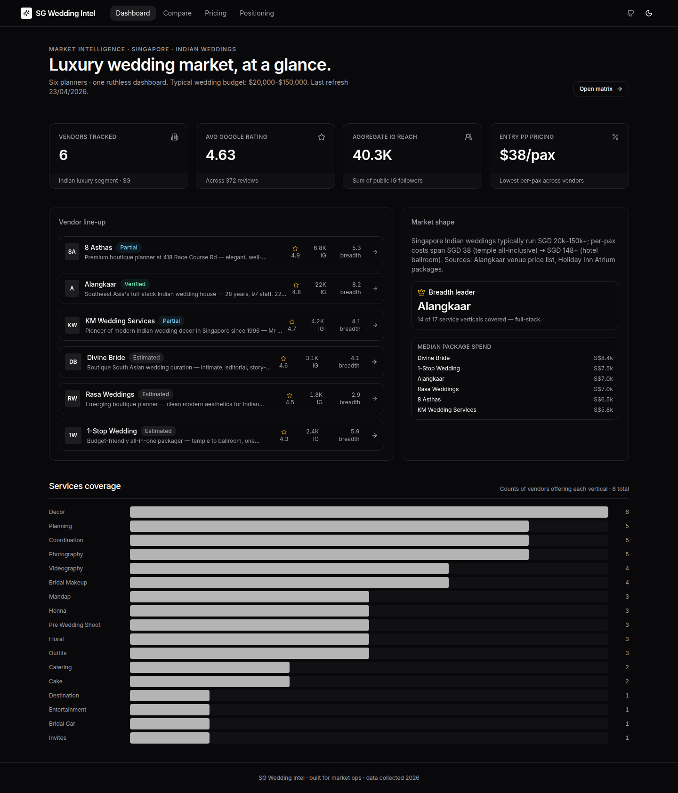
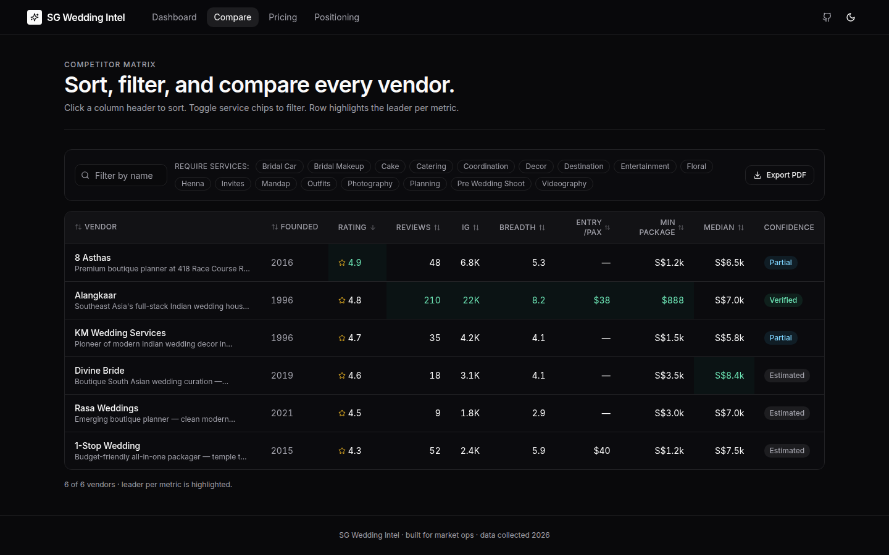
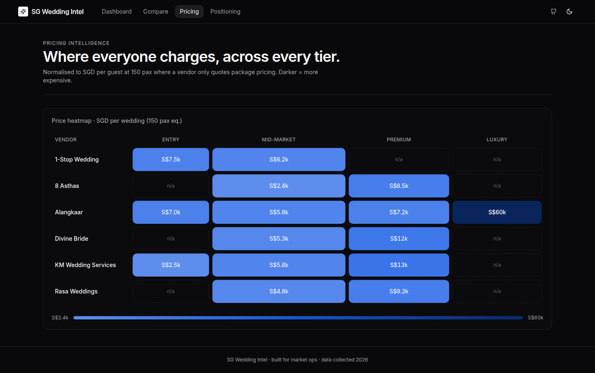
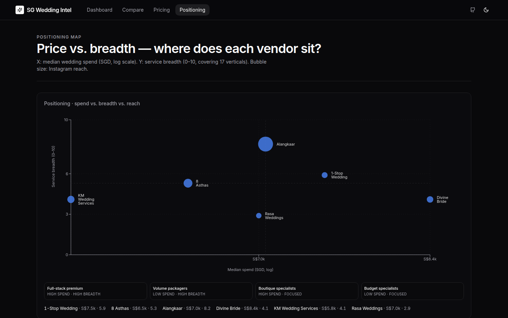
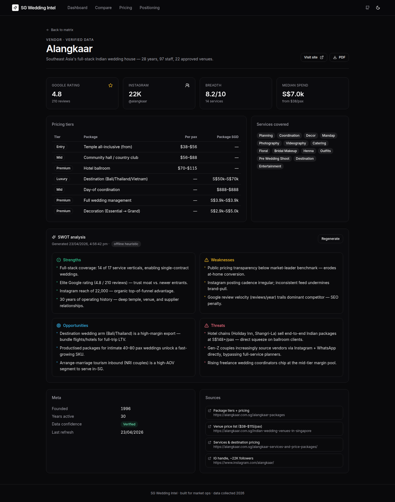

# SG Wedding Intel

> Singapore Luxury Indian Wedding Market — one dashboard. Six vendors, normalised.

Pricing, reach, breadth, and SWOT across six Singapore Indian wedding planners — Alangkaar, 8 Asthas, KM Wedding Services, Divine Bride, Rasa Weddings and 1-Stop Wedding. Next.js 14 · TypeScript · Tailwind · SQLite · react-pdf · Playwright.

---

## Screens

**Dashboard** — KPIs, vendor league table, services coverage.



**Competitor matrix** — sort any column, filter by required services, export to PDF.



**Pricing heatmap** — SGD per wedding (150-pax eq.) across four tiers.



**Positioning map** — spend × breadth × IG-reach bubble scatter with quadrant legend.



**Vendor detail + SWOT** — per-vendor dossier; SWOT generated by the Anthropic API when configured, otherwise by a transparent offline heuristic (labelled in the UI).



---

## Run it

```bash
pnpm i && pnpm dev
```

That's it. The app boots at `http://localhost:3000` with data already seeded into SQLite from `data/vendors.seed.json` on first request.

### Optional — Anthropic-backed SWOTs

```bash
export ANTHROPIC_API_KEY=sk-ant-...
# optional:
export ANTHROPIC_MODEL=claude-sonnet-4-5
pnpm dev
```

Without the key, the SWOT API falls back to a deterministic, fact-referenced heuristic (the UI clearly labels the source; results are cached to `data/swot-cache/<slug>.json`).

### Refresh research

```bash
pnpm refresh
```

For each vendor with a URL, the refresh agent:
1. Fetches the public site (10 s timeout, polite UA).
2. Reads `schema.org` JSON-LD to pick up `aggregateRating` → updates `googleRating`/`googleReviews` when present.
3. Stamps `updatedAt` on each record.
4. Reseeds the SQLite DB.

Instagram follower and Google review counts require `ig Graph API` / `Places API` tokens to scrape reliably — when absent, existing values are preserved and the TODO is printed (no fabrication).

---

## Architecture

```
app/               Next 14 App Router
 ├─ page.tsx         Dashboard
 ├─ compare/         Competitor matrix
 ├─ pricing/         Heatmap
 ├─ positioning/     2D scatter
 ├─ vendor/[slug]/   Dossier + SWOT
 └─ api/
      ├─ vendors/         GET dataset
      ├─ swot/            GET per-vendor SWOT (Anthropic or heuristic)
      └─ export-pdf/      GET streaming PDF (compare | vendor)
components/        React UI (shadcn-style primitives + chart wrappers)
lib/               db · vendor-types · swot · pdf · utils
data/
 ├─ vendors.seed.json   Committed research — source of truth
 ├─ vendors.db          SQLite (git-ignored, re-seeded on boot)
 ├─ swot-cache/         Cached SWOT JSON per vendor
 └─ screenshots/        README screenshots (captured by Playwright)
scripts/
 ├─ seed.ts          Reseed SQLite from JSON
 └─ refresh.ts       Refresh agent (pnpm refresh)
tests/e2e/          Playwright (3 flows + screenshots)
```

## Data model

```ts
type Vendor = {
  slug: string
  name: string
  tagline: string
  foundedYear: number | null
  url?: string
  instagramHandle?: string
  instagramFollowers: number
  googleRating: number                // 0–5
  googleReviews: number
  services: Service[]                 // 17 verticals available
  pricing: { tier, label, perPaxSgd?, packageSgd? }[]
  dataConfidence: "verified" | "partial" | "estimated"
  sources: { url, note }[]
  updatedAt: string                   // ISO
}
```

Every vendor row carries its own `dataConfidence` and an explicit `sources[]` list. The UI surfaces these on the detail page so you can audit the number, not just trust it.

## Tests

```bash
pnpm test:e2e
```

Three flows are covered end-to-end:

| Spec                  | Covers                                                         |
| --------------------- | -------------------------------------------------------------- |
| `dashboard.spec.ts`   | KPI cards render, vendor list loads, link navigates to detail. |
| `compare.spec.ts`     | Sort, name-filter, service-filter, and PDF export link.        |
| `charts.spec.ts`      | Heatmap table shape, positioning scatter renders 6 SVG points, `/api/export-pdf` returns a real PDF. |

A fourth spec (`screenshots.spec.ts`) captures every page for this README.

## Design notes

- Dark-first. `next-themes` with a toggle in the top nav.
- Framer Motion on page/card mount — cubic-bezier `(0.16, 1, 0.3, 1)` at 300–400 ms.
- Recharts for heatmap + scatter; no D3.
- Loading skeletons on the SWOT card (async fetch) and an empty state on the compare matrix.
- All primitives (`Button`, `Card`, `Badge`, `Input`, `Select`, `Skeleton`) are hand-written shadcn-style — no shadcn CLI run in this repo.

## Deploy to Vercel

```bash
pnpm i -g vercel
vercel link
vercel --prod
```

If you want Anthropic-backed SWOTs in production, add `ANTHROPIC_API_KEY` (and optionally `ANTHROPIC_MODEL`) to the Vercel project env.

> **Note:** the sandbox where this was built has no `VERCEL_TOKEN`, so no preview URL is embedded here. Run the three lines above locally and the preview URL will print.

## Data provenance

Every vendor in `data/vendors.seed.json` lists a `sources[]` array. Alangkaar has verified data across pricing tiers, IG, and Google rating. 8 Asthas and KM Wedding Services have partial data (pricing tiers are indicative, sourced from their websites and third-party SG wedding directories). Divine Bride / Rasa Weddings / 1-Stop Wedding are estimated — their public footprint is thin and the `dataConfidence` flag reflects that honestly.

The positioning and price charts normalise vendors with only per-pax pricing by multiplying through 150 pax — the SG median guest count for Indian weddings.

---

Built as a single-command-to-run demo of what a weekend of focused eng can produce — dense, auditable, testable.
