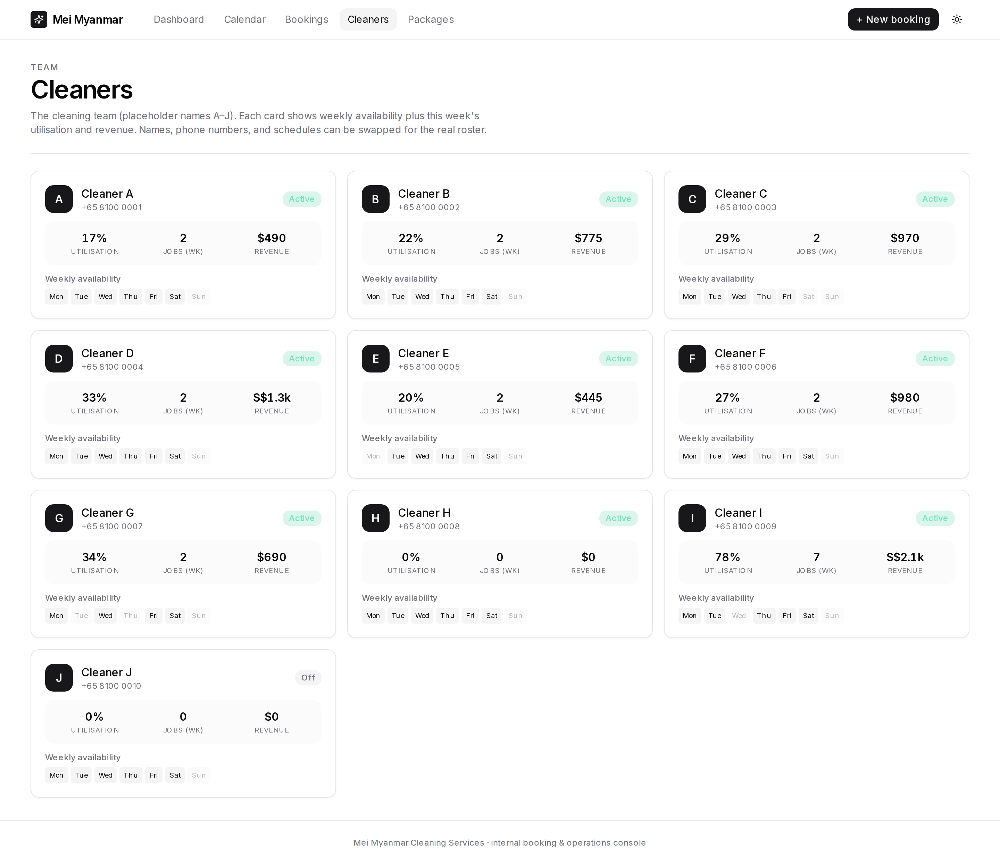

# Mei Myanmar Cleaning Services — Booking & Operations Console

An internal web app for a part-time cleaning agency. Service staff book jobs on a
calendar, pick a package, set the amount, assign a cleaner, and email the customer
a confirmation — while management sees live **revenue** and **cleaner utilisation**.

> This is a working demo seeded with placeholder data (cleaners A–J, five sample
> packages, and ~3 weeks of sample bookings). The real cleaner roster, schedules,
> and price list drop straight into `lib/seed-data.ts`.

## What it does

- **Dashboard** (`/`) — revenue today / this week / last 30 days, team utilisation,
  revenue-by-package mix, and upcoming jobs.
- **Calendar** (`/calendar`) — week-at-a-glance schedule, colour-coded by package,
  filterable by cleaner. Click any empty slot to start a booking pre-filled with
  that day and time.
- **New booking flow** — pick (or create) a customer, choose a package (auto-fills
  duration + price, which staff can override), assign a cleaner and time, then
  **send the customer a confirmation email**. Double-bookings for the same cleaner
  are blocked.
- **Bookings** (`/bookings`) — searchable list; mark jobs complete/cancelled and
  see who has been emailed.
- **Cleaners** (`/cleaners`) — roster with weekly availability and each cleaner's
  utilisation, job count, and revenue for the week.
- **Packages** (`/packages`) — the service plans with price, duration, crew size,
  and 30-day demand.

## Tech

Next.js 14 (App Router) · TypeScript · Tailwind · Recharts · better-sqlite3.
Data lives in a local SQLite file (`data/cleaning.db`), auto-created and seeded on
first run.

## Run locally

```bash
pnpm install      # builds the better-sqlite3 native binding
pnpm dev          # http://localhost:3000
```

Other scripts: `pnpm build` / `pnpm start` (production), `pnpm typecheck`.

To reset the demo data, delete `data/cleaning.db*` and restart — it reseeds.

## Customising for the client

Everything the client provides plugs into one file, **`lib/seed-data.ts`**:

- `SEED_CLEANERS` — replace names, phones, `active` flags, and weekly
  `availability` windows for each cleaner.
- `SEED_PACKAGES` — set the real package names, prices, durations, and crew sizes.
- `COMPANY` — business name, contact details, and operating hours used in the app
  and in the confirmation emails.

## Email sending

The confirmation email is fully composed (subject + body, customer-addressed) and
previewed before sending. With no SMTP credentials wired up, **Send confirmation**
records the send and offers an "Open in mail app" (`mailto:`) fallback so staff can
send from their own inbox today. To send automatically, plug an email provider
(e.g. Resend/SendGrid/SMTP) into `app/api/bookings/[id]/email/route.ts`.

## Screenshots

| Dashboard | Calendar |
| --- | --- |
|  |  |

| Bookings | Cleaners |
| --- | --- |
|  |  |
